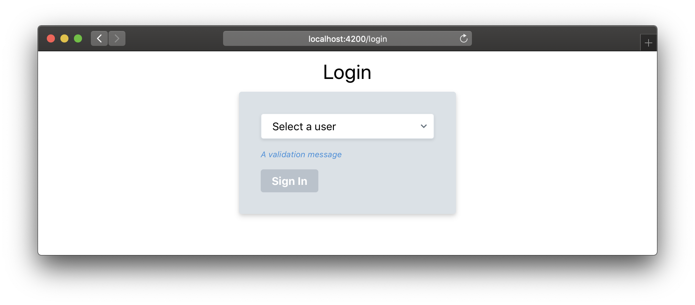
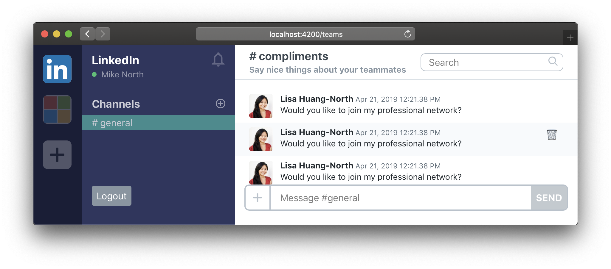
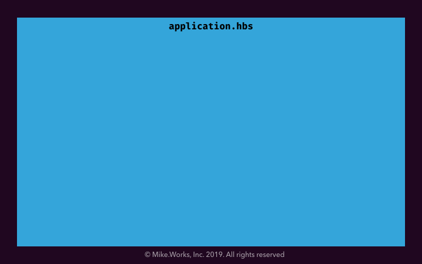

# First Routes

Our next step will be to add a login screen.

We'll want this to show up when the user visits http://localhost:4200/login,



and the chat UI showing up when users visit http://localhost:4200/teams



## What's routing

Whenever we think about URL-driven state (or content), [Routing](https://octane-guides-preview.emberjs.com/release/routing/) is likely to be involved. Our router [`app/router.js`](../app/router.js) responds to URL changes, and the appropriate routes take care of the particulars of bringing the application into the correct state for that URL (fetching the right data, rendering the right thing, etc...)

Each route is associated with a top-level template (the `.hbs` files in `app/templates` _other than_ the ones in `app/templates/components`) of a similar name. For example [`app/routes/teams.js`](../app/routes/teams.js) would have [`app/templates/teams.hbs`](../app/templates/teams.hbs) as its corresponding top-level template.

The contents of our [app/templates/application.hbs](../app/templates/application.hbs) file will show up on the screen regardless of URL, but if we add a `{{outlet}}` to the template, any "child routes" will render their content into the outlet.

The `application` route (we have no corresponding file for this in our project) is the highest-level route, and children can be nested such that we URL-specific content to meet our app's needs

### An Example Routing Hierarchy

```yaml
application # application.hbs
  login     # login.hbs
  teams     # teams.hbs
    team    #   teams/team.hbs
      channel # teams/team/channel.hbs
```



## ⌨️ Task: The `/teams` route

In this task, we'll create a new top-level template that's displayed on the screen for URLs that begin with `/teams`.

To start, recall that the [app/templates/application.hbs](../app/templates/application.hbs) template is going to show up on the screen regardless of URL, so we'll want to change that first so that it's only rendered for appropriate URLs.

Run the following command to generate a `teams` route

```sh
ember generate route teams
```

This should result in new files being created

- [`app/routes/teams.js`](../app/routes/teams.js) - the JS module for the route
- [`app/templates/teams.hbs`](../app/templates/teams.hbs) - a template to be shown when we visit `/teams`
- [`tests/unit/routes/teams-test.js`](../tests/unit/routes/teams-test.js) - a unit test for the route

You may also notice that your [`app/router.js`](../app/router.js) has been modified to "install" the new route.

1. copy the contents of [`app/templates/application.hbs`](../app/templates/application.hbs) into [`app/templates/teams.hbs`](../app/templates/teams.hbs)
1. replace the contents of [`app/templates/application.hbs`](../app/templates/application.hbs) with `{{outlet}}`, so that either of the sibling routes [`teams.hbs`](../app/templates/teams.hbs) or [`login.hbs`](../app/templates/login.hbs) will be rendered into the outlet, depending on the URL

You should now see...

- visiting http://localhost:4200/ shows a blank screen, with no JS errors in the console
- visiting http://localhost:4200/teams shows the chat UI

## ⌨️ Task: The `/login` route

The goal of this task is to get a login screen showing up whenever users visit URLs starting with `/login`.

Run the following command to generate a `login` route

```sh
ember generate route login
```

This should result in new files being created

- [`app/routes/login.js`](../app/routes/login.js) - the JS module for the route
- [`app/templates/login.hbs`](../app/templates/login.hbs) - a template to be shown when we visit `/login`
- [`tests/unit/routes/login-test.js`](../tests/unit/routes/login-test.js) - a unit test for the route

Paste the HTML below into [`app/templates/login.hbs`](../app/templates/login.hbs)

<details>

<summary>Click to reveal login screen HTML</summary>

```html {starter-file=login.html}
<div class="mx-auto">
  <div class="flex justify-center flex-row w-full leading-loose text-3xl">
    Login
  </div>
  <div class="flex justify-center flex-row w-full">
    <div class="w-full max-w-xs">
      <form class="bg-grey-light shadow-md rounded px-8 pt-6 pb-8 mb-4">
        <div class="inline-block relative w-64 mt-2">
          <select
            class="block appearance-none w-full bg-white border border-grey-light hover:border-grey px-4 py-2 pr-8 rounded shadow leading-tight focus:outline-none focus:shadow-outline"
          >
            <option value="" disabled>Select a user</option>
            <option value="1">Testy Testerson</option>
            <option value="2">Sample McData</option>
          </select>
          <div
            class="pointer-events-none absolute pin-y pin-r flex items-center px-2 text-grey-darker"
          >
            <svg
              class="fill-current h-4 w-4"
              xmlns="http://www.w3.org/2000/svg"
              viewBox="0 0 20 20"
            >
              <path
                d="M9.293 12.95l.707.707L15.657 8l-1.414-1.414L10 10.828 5.757 6.586 4.343 8z"
              ></path>
            </svg>
          </div>
        </div>
        <p class="text-blue text-xs italic my-4">
          A validation message
        </p>
        <div class="flex items-center justify-between">
          <input
            class="bg-grey text-white font-bold py-2 px-4 rounded focus:outline-none focus:shadow-outline"
            value="Sign In"
            type="submit"
          />
        </div>
      </form>
    </div>
  </div>
</div>
```

</details>

You should now see...

- visiting http://localhost:4200/ shows a blank screen, with no JS errors in the console
- visiting http://localhost:4200/login shows the login UI
- visiting http://localhost:4200/teams shows the chat UI

## ⌨️ Task: Creating a basic link

In this task, we'll create our first link between routes. The default browser behavior when receiving a click on an `<a href="..."></a>` is to trigger a full page load, and this is not what we want.

Ember provides a tool for this called [`link-to`](https://api.emberjs.com/ember/release/classes/Ember.Templates.helpers/methods/link-to?anchor=link-to).

`link-to` is a powerful tool, but for now we'll use it in a basic way: making the "Logout" button in the chat UI send the user to the login screen

First, open up [`app/templates/components/team-sidebar.hbs`](../app/templates/components/team-sidebar.hbs) and find the `Logout` button near the bottom.

```diff
@ team-sidebar.hbs:44 @
   </nav>

   <footer class="mx-4 mb-2 text-white">
-    <button class="text-white rounded bg-grey-darker hover:bg-red-darker p-2 team-sidebar__logout-button">
+    <LinkTo @route='login' {{! destination route }}
+            class="text-white rounded bg-grey-darker no-underline hover:bg-red-darker p-2 team-sidebar__logout-button"
+    >
       Logout
-    </button>
+    </LinkTo>
   </footer>
 </section>
```

A11y tip: Notice that this logout "button" is still a link, even though it looks like a button. A way to remember when to use a link and when to use a button is to use a link if it goes to a URL, and a button if it's a toggle.

You should now be able to click on the "Logout" button and find yourself looking at the login screen with a `/login` url.

Congrats! we've just set up our first routes!
